# Tredie — Flowcharts

Format: **Mermaid** (draw.io import native).

**Cara import ke draw.io:**
1. Buka draw.io → New Diagram → Blank
2. Menu **Extras → Edit Diagram...** → pilih format **Mermaid** → paste blok yang lo mau
3. Atau: **Arrange tab → "+" Insert → Advanced → Mermaid** → paste

Tiap section di bawah berdiri sendiri — paste blok Mermaid (yang ada di antara ` ```mermaid ` dan ` ``` `) satu-satu.

---

## 1. System Architecture (High-Level)

Komponen utama, integrasi eksternal, dan arah data.

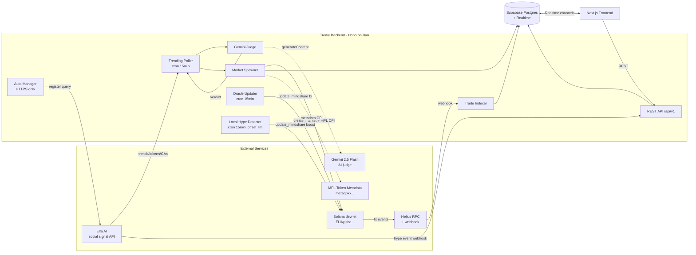

---

## 2. Data Model (ER)

Tabel utama dan relasinya.

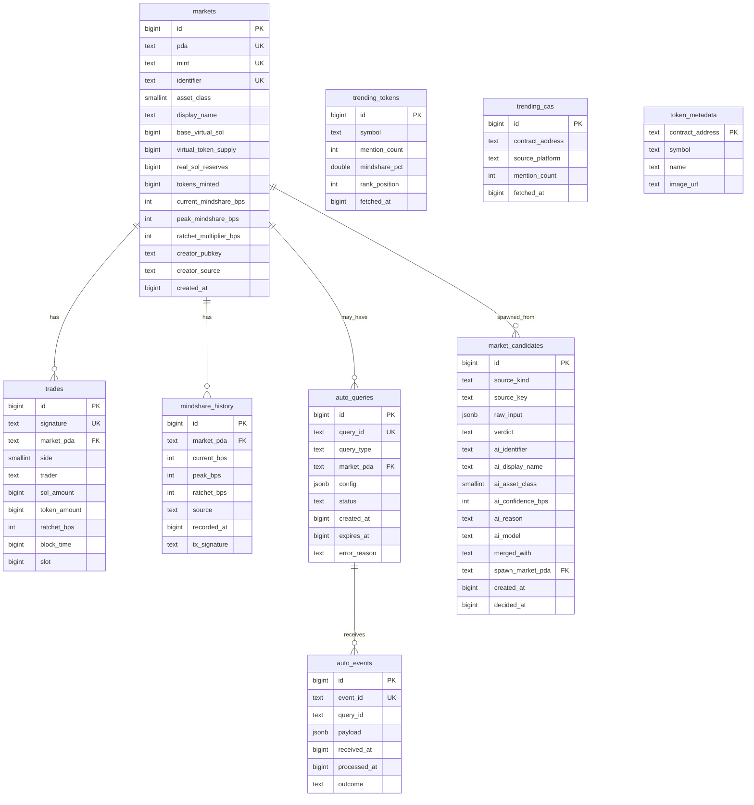

---

## 3. Business Logic — Market Lifecycle

State machine untuk satu market dari kandidat sampai active trading.

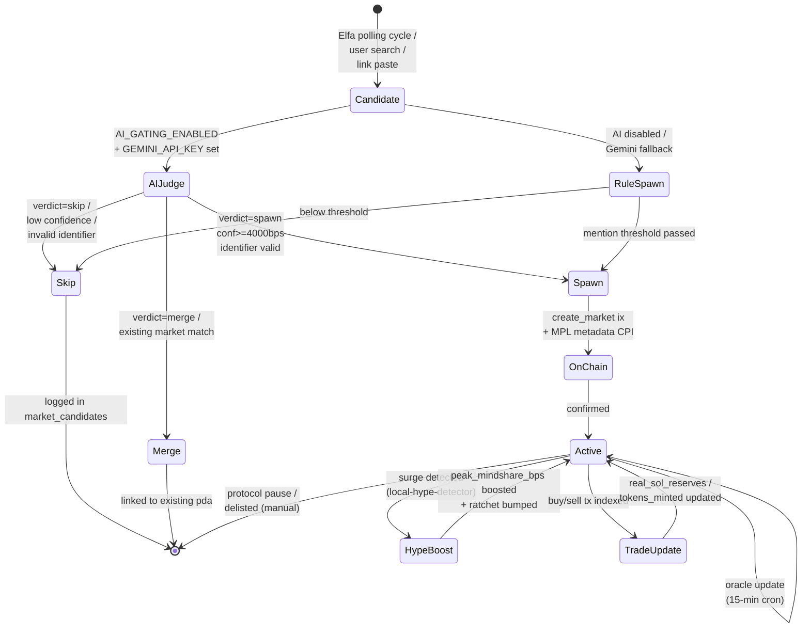

---

## 4. Spawn Pipeline (with AI Gating)

Detail flow dari Elfa polling sampai market ter-spawn on-chain.

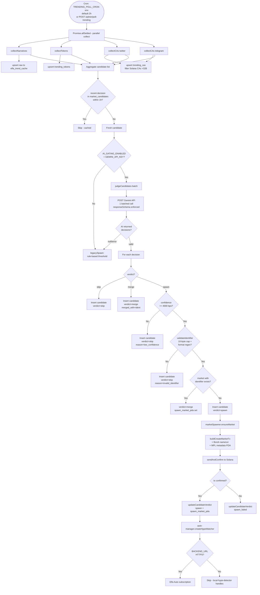

---

## 5. AI Verdict Outcomes (Case Flows)

Apa yang terjadi per verdict + edge cases.

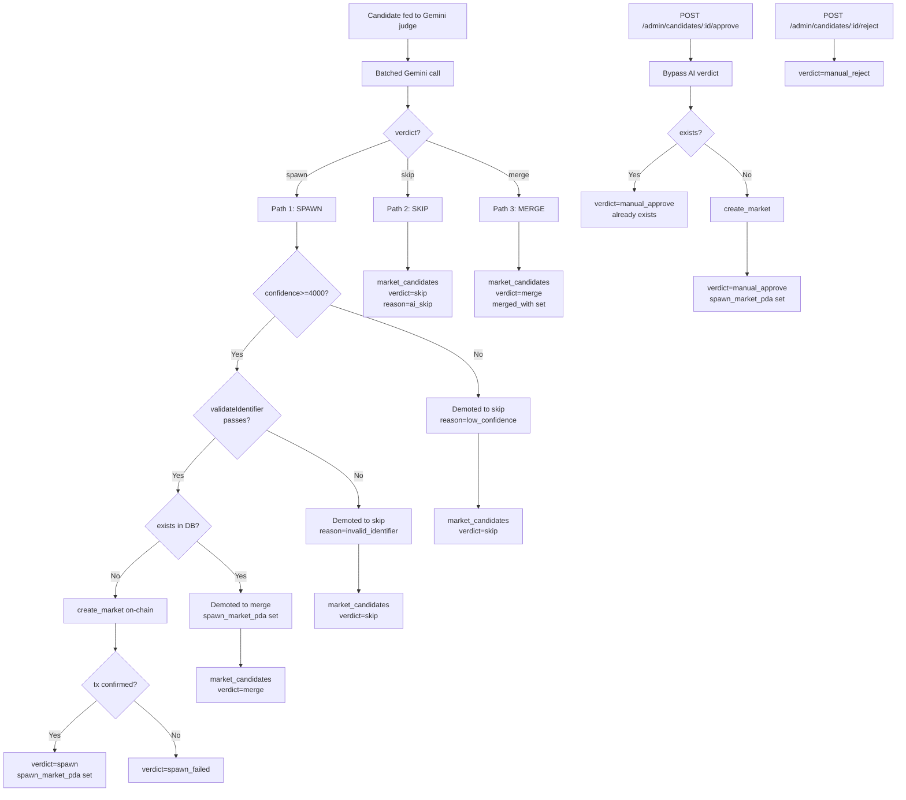

---

## 6. User Flow A — Search & Spawn (BYPASS AI)

User cari ticker / paste identifier → langsung spawn tanpa AI gating.

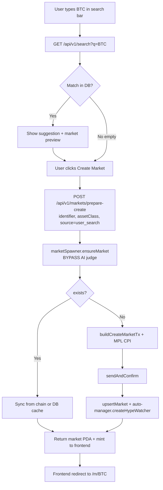

---

## 7. User Flow B — Trade (Buy / Sell)

User beli/jual attention token via wallet signature.

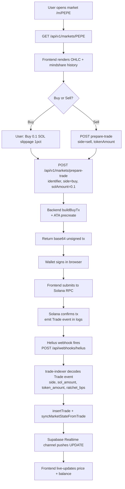

---

## 8. User Flow C — Paste Link

User paste URL → backend resolve metadata → suggest identifier → user confirm.

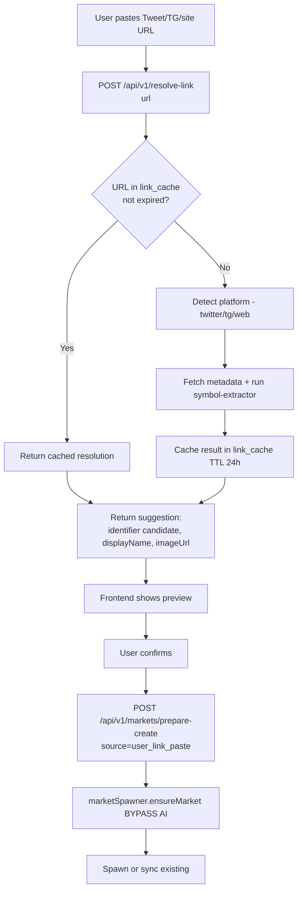

---

## 9. Service — Oracle Updater

Cron 15-min: pull mindshare dari Elfa keyword-mentions → push ke on-chain oracle.

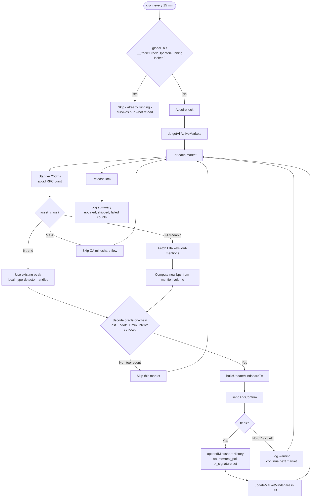

---

## 10. Service — Local Hype Detector

Self-hosted condition engine (Elfa Auto failed di free tier). Cron 15-min offset 7m dari oracle-updater.

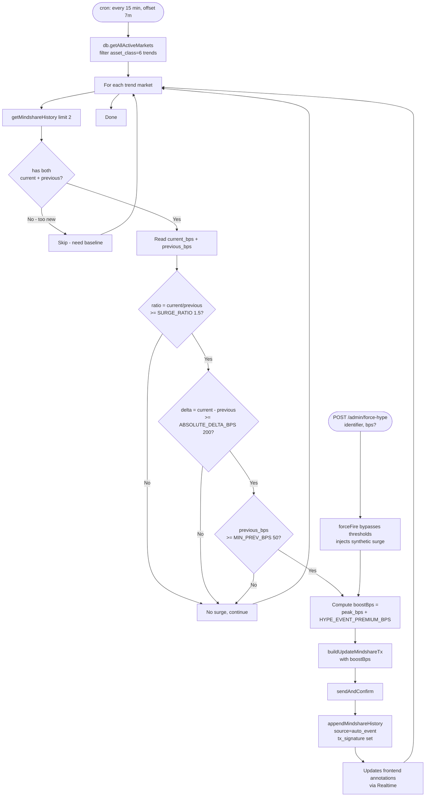

---

## 11. Service — Trade Indexer (Helius Webhook)

Solana tx confirmed → Helius push → decode Trade event log → upsert ke DB.

```mermaid
flowchart TD
    T1[Solana tx confirmed<br/>buy/sell instruction]
    T2[Helius posts to /api/webhooks/helius]
    T3{Authorization Bearer<br/>== HELIUS_WEBHOOK_SECRET?}
    T4[401 Unauthorized]
    T5[Parse tx array body]
    T6[For each tx]

    T7{has signature<br/>signature OR transaction.signatures[0]?}
    T8[Skip - log warning]

    T9[Inspect meta.logMessages]
    T10{Anchor Trade event<br/>discriminator detected?}
    T11[Skip - not a Trade]

    T12[Decode Trade event:<br/>side, sol_amount, token_amount,<br/>ratchet_bps, market, trader]
    T13[insertTrade ON CONFLICT DO NOTHING]
    T14[syncMarketStateFromTrade<br/>real_sol_reserves, tokens_minted, slot]

    T15[Realtime publication pushes<br/>INSERT to supabase_realtime]
    T16[Frontend subscribed to channel<br/>updates UI live]

    T1 --> T2 --> T3
    T3 -->|No| T4
    T3 -->|Yes| T5 --> T6 --> T7
    T7 -->|No| T8 --> T6
    T7 -->|Yes| T9 --> T10
    T10 -->|No| T11 --> T6
    T10 -->|Yes| T12 --> T13 --> T14 --> T15 --> T16
```

---

## 12. Service — Auto Manager + Elfa Auto Webhook

Hype watcher subscription (HTTPS only) + inbound webhook handler.

```mermaid
flowchart TD
    subgraph register[Register Phase - on market spawn]
        R1[New market spawned]
        R2[auto-manager.createHypeWatcher]
        R3{BACKEND_URL<br/>HTTPS?}
        R4[Skip - log debug<br/>local-hype-detector covers dev]
        R5{asset_class=5<br/>+ identifier > 20 chars?}
        R6[Skip - Auto symbol cap]
        R7[buildConditions per class<br/>tradable: TA + LLM<br/>trend: LLM only]
        R8[autoClient.validateQuery]
        R9{valid?}
        R10[insertFailedAutoQuery<br/>error_reason]
        R11[autoClient.createQuery]
        R12[insertAutoQuery<br/>status=active expires_at]

        R1 --> R2 --> R3
        R3 -->|No HTTP| R4
        R3 -->|Yes HTTPS| R5
        R5 -->|Yes| R6
        R5 -->|No| R7 --> R8 --> R9
        R9 -->|No| R10
        R9 -->|Yes| R11 --> R12
    end

    subgraph webhook[Webhook Phase - hype event fires]
        W1[Elfa Auto trigger fires]
        W2[POST /api/webhooks/elfa]
        W3{HMAC-SHA256<br/>SHA256 secret . ts.eventId.body<br/>= X-Auto-Signature v1=hex?}
        W4[401 invalid signature]
        W5{ts within 30s<br/>replay window?}
        W6[401 stale]
        W7{X-Auto-Event-Id<br/>already in auto_events?}
        W8[200 duplicate]
        W9[insertAutoEvent + 202]
        W10[Background: lookup market by query_id]
        W11[Compute boostBps<br/>peak + HYPE_EVENT_PREMIUM_BPS]
        W12[buildUpdateMindshareTx]
        W13[sendAndConfirm]
        W14[markAutoEventProcessed<br/>+ appendMindshareHistory<br/>source=auto_event]

        W1 --> W2 --> W3
        W3 -->|No| W4
        W3 -->|Yes| W5
        W5 -->|No| W6
        W5 -->|Yes| W7
        W7 -->|Yes| W8
        W7 -->|No| W9 --> W10 --> W11 --> W12 --> W13 --> W14
    end

    subgraph rotate[Rotation Phase - daily 02:00 UTC]
        Rot1[cron: 0 2 * * *]
        Rot2[getAutoQueriesExpiringSoon<br/>within 24h]
        Rot3[For each]
        Rot4[autoClient.cancelQuery]
        Rot5[Re-run createHypeWatcher<br/>fresh 7d expiry]

        Rot1 --> Rot2 --> Rot3 --> Rot4 --> Rot5
    end
```

---

## 13. Cron Schedule (Reference Card)

| Service | Schedule | Configurable? | Purpose |
|---------|----------|---------------|---------|
| Trending Poller | `TRENDING_POLL_CRON` env, default `0 */2 * * *` (every 2h) | ✅ env-tunable | Elfa polling + AI gating + spawn |
| Oracle Updater | `*/15 * * * *` | hardcoded | Push mindshare to on-chain oracle |
| Local Hype Detector | `7,22,37,52 * * * *` | hardcoded | Detect surges, boost peak on-chain |
| Auto Rotation | `0 2 * * *` (daily 02:00) | hardcoded | Recreate expiring Auto subscriptions |

The TrendingPoller default is throttled to 2h to fit inside the Gemini free
tier (20 requests/day). Bump to `*/15 * * * *` if running a paid Gemini plan.

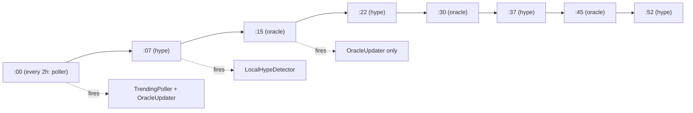

---

## 14. create_market Instruction Anatomy

Detail layout TX yang dikirim backend ke Solana program (post MPL CPI).

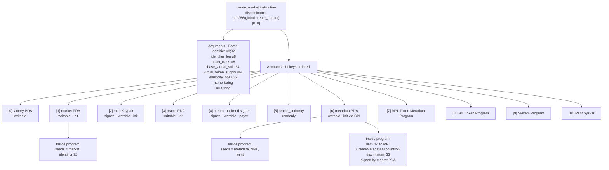

---

## Notes

- **AI gating** cuma covers spawn dari `TrendingPoller` (cron + admin manual trigger). User-initiated spawn (`prepare-create`) bypass AI by design — user intent dianggap eksplisit.
- **CA spawning (asset_class=5) currently broken** post-MPL upgrade — Solana addresses are 32-44 bytes UTF-8, exceed both seed cap (32) dan MPL symbol cap (10). Pre-filter di `collectCAs` skips them. Fix butuh SC patch.
- **Trend identifier convention** `t:<slug>` ≤10 bytes (was `trend:` ≤32 bytes). Backward compat: `trendIdToKeyword` + `isTrendId` recognize both prefixes — markets di-spawn pre-convention tetep functional, just no MPL metadata.
- **bun --hot duplicate cron** dimitigasi via `globalThis.__tredieOracleUpdaterRunning` + `__tredieOracleCronRegistered` flags — survive module reload.
- **Helius webhook signature parse** has fallback chain: `tx.signature ?? tx.transaction?.signatures?.[0]` (raw vs enhanced format).
- **Elfa Auto webhook HMAC** uses `SHA256(ELFA_AUTO_WEBHOOK_SECRET)` as the signing key (not the raw secret) — `HMAC-SHA256(signing_key, ts.eventId.rawBody)`.
