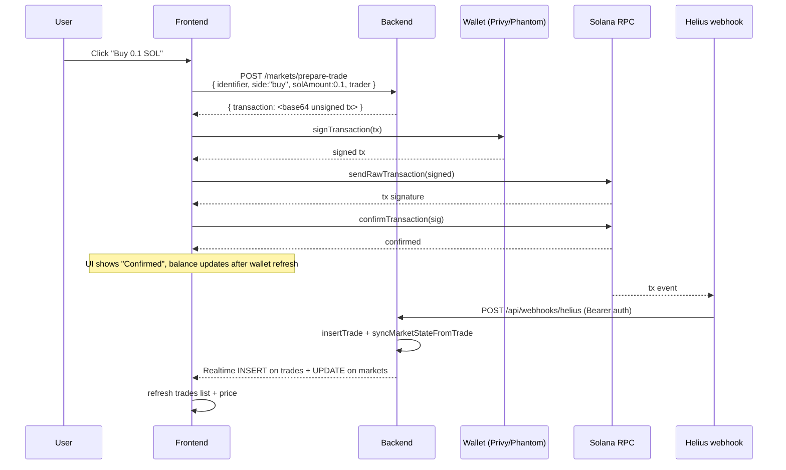

# Frontend Integration Guide

Quick reference for wiring the Next.js frontend (`/frontend`) to the backend (`/backend`).

**Audit date**: 2026-05-08 — frontend rebuild commit `5d00238` + `9a64333` (ancung) + landing-page polish series.

This doc reflects the **actual backend code** at HEAD (`d7908e3`), not the planned shape in `frontend/BUILD.md`. Where they diverge, this doc is authoritative — `BUILD.md` may have planned things that aren't built yet, or built things differently.

---

## TL;DR — Coverage Status

| Frontend feature | Backend endpoint | Status |
|------------------|------------------|--------|
| List markets (Topics, Tokens) | `GET /api/v1/markets` | ✅ + sparkline + 24h vol/holders |
| Market detail page | `GET /api/v1/markets/:identifier` | ✅ + autoEvents + 24h stats |
| Trades table | `GET /api/v1/markets/:identifier/trades` | ✅ |
| OHLC chart (price candles) | `GET /api/v1/markets/:identifier/ohlc` | ✅ |
| Oracle live mindshare | `GET /api/v1/markets/:identifier/oracle` | ✅ |
| AI thesis card | `GET /api/v1/markets/:identifier/ai-context` | ⚠️ free-tier 502 |
| Trade estimate preview | `POST /api/v1/markets/estimate` | ✅ (server-side AMM) |
| Trade buy/sell | `POST /api/v1/markets/prepare-trade` | ✅ + slippage protection |
| Create market on demand | `POST /api/v1/markets/prepare-create` | ✅ |
| Search bar | `GET /api/v1/search?q=` | ✅ |
| Resolve pasted link | `POST /api/v1/resolve-link` | ✅ |
| Trending tokens | `GET /api/v1/trending/tokens` | ✅ |
| Trending CAs | `GET /api/v1/trending/cas/:platform` | ✅ |
| Portfolio (per-user holdings) | `GET /api/v1/portfolio/:address` | ✅ positions + PnL + activity |
| Factory state | `GET /api/v1/factory` | ✅ |
| Auto-query state (debug) | `GET /api/v1/auto-queries` | ✅ |
| Health check | `GET /api/v1/health` | ✅ |
| Realtime price/trade updates | Supabase Realtime channels | ✅ backend, ⚠️ FE not wired |

**All frontend needs covered.** Only known limitation: CA (asset_class=5) spawn requires SC patch — pre-filtered out at the polling layer. See **§9** for details.

---

## 1. Configuration

### Backend env (`backend/.env`)

Already configured. Frontend doesn't touch these — listed for context.

| Var | Used for |
|-----|----------|
| `PORT=4000` | API listen port |
| `DATABASE_URL` | Supabase Postgres pooler |
| `SUPABASE_URL`, `SUPABASE_SERVICE_ROLE_KEY` | Realtime publication owner |
| `SOLANA_RPC_URL` | Helius devnet RPC for tx ops |
| `TREDIE_PROGRAM_ID` | On-chain program addr |
| `BACKEND_URL` | Self-URL for Elfa Auto webhook callback (HTTPS required) |

### Frontend env (`frontend/.env.local`)

Required public vars. **All must start with `NEXT_PUBLIC_`** since they're read on the client.

```bash
# Backend API base — use ngrok for prod-like demo over HTTPS, localhost for pure-local
NEXT_PUBLIC_BACKEND_URL=http://localhost:4000

# Supabase Realtime (anon key, NOT service-role)
NEXT_PUBLIC_SUPABASE_URL=https://<project>.supabase.co
NEXT_PUBLIC_SUPABASE_ANON_KEY=<anon-key>

# Solana
NEXT_PUBLIC_SOLANA_RPC=https://devnet.helius-rpc.com/?api-key=<helius-key>
NEXT_PUBLIC_SOLANA_NETWORK=devnet
NEXT_PUBLIC_TREDIE_PROGRAM_ID=EUAyjsbak9hRXPxU4zdDWwrL1Qy8RpwmfV9PNGKpdxBU

# Privy auth
NEXT_PUBLIC_PRIVY_APP_ID=<privy-app-id>
```

> **Naming note**: `frontend/BUILD.md` references both `NEXT_PUBLIC_SOLANA_RPC` and `NEXT_PUBLIC_HELIUS_RPC_URL` in different places. The current `PrivyProviderWrapper.tsx` reads `NEXT_PUBLIC_HELIUS_RPC_URL`. Pick one and align — recommended: `NEXT_PUBLIC_SOLANA_RPC` since the backend already uses `SOLANA_RPC_URL` (the URL is Helius-flavored but the var is generic).

### CORS

Backend Hono has CORS enabled by default for all origins in dev. Production should tighten via Hono's `cors` middleware in `backend/src/index.ts`.

### Base URL pattern

All API calls go to `${NEXT_PUBLIC_BACKEND_URL}/api/v1/...`.

Suggested `frontend/src/lib/api.ts`:

```ts
import ky from 'ky';

const baseUrl = process.env.NEXT_PUBLIC_BACKEND_URL ?? 'http://localhost:4000';

export const api = ky.create({
  prefixUrl: `${baseUrl}/api/v1`,
  timeout: 15_000,
  hooks: {
    beforeError: [
      async (err) => {
        try {
          const body = await err.response.json();
          (err as any).serverError = body;
        } catch {}
        return err;
      },
    ],
  },
});
```

---

## 2. Endpoint Reference

All paths are relative to `${NEXT_PUBLIC_BACKEND_URL}/api/v1`.

Response shapes are pulled directly from `backend/src/api/*.ts` — the actual code, not BUILD.md plans.

### 2.1 Health

```
GET /health             → 200 { ok, version, stack, slot, lastIndexedTrade, checks: { db, solana } }
GET /health/db          → 200 if DB reachable, 503 otherwise
GET /health/solana      → 200 if RPC.getSlot succeeds
GET /health/elfa        → 200 if /v2/ping passes (free tier may pass)
```

Use `/health` as the single check on app boot. If `checks.db` or `checks.solana` is false, show a banner.

### 2.2 List markets

```http
GET /markets?type=&assetClass=&limit=&sortBy=&order=&sparkline=
```

| Query | Type | Default | Notes |
|-------|------|---------|-------|
| `type` | `token \| topic` | (none) | **High-level group for FE tabs.** `token` = tradable assets (asset_class 0-4); `topic` = trends (asset_class 6). Returns 400 on any other value. |
| `assetClass` | `0..6` | (none) | Fine-grained class filter. Takes precedence over `type` if both given. |
| `limit` | int | 50 | max 100 |
| `sortBy` | `mindshare \| volume` | `mindshare` | `volume` = `real_sol_reserves` desc |
| `order` | `asc \| desc` | `desc` |  |
| `sparkline` | `true \| false` | `true` | Set `false` to skip the 24h sparkline aggregate (faster) |

**Tab filtering pattern**:
```ts
// Tokens tab
const tokens = await api.get('markets', { searchParams: { type: 'token' } }).json();
// Topics tab
const topics = await api.get('markets', { searchParams: { type: 'topic' } }).json();
```

**Response 200**:
```ts
{
  markets: EnrichedMarketRow[],
  total: string  // bigint serialized as string
}
```

`EnrichedMarketRow` = `MarketRow` plus aggregations + token economics (computed in one bulk pass — no N+1):

```ts
interface EnrichedMarketRow extends MarketRow {
  // 24h aggregations from trades + mindshare_history
  volume_24h_lamports: string;     // bigint string — sum of trade.sol_amount last 24h
  trade_count_24h: string;         // bigint string
  holders_count: string;           // bigint string — distinct trader count (lifetime)
  sparkline_24h: number[];         // hourly avg current_mindshare_bps, oldest first
                                    // Empty array if `sparkline=false` or no history

  // Token economics derived from AMM curve state
  spot_price_lamports: number;     // (base_virtual_sol + real_sol_reserves) /
                                    // (virtual_token_supply - tokens_minted)
                                    // = lamports per token base unit
  market_cap_lamports: string;     // bigint — spot_price × tokens_minted
                                    // (circulating supply × current price)
  fdv_lamports: string;            // bigint — spot_price × virtual_token_supply
                                    // (fully diluted valuation)
  liquidity_lamports: string;      // bigint — real_sol_reserves
                                    // (actual SOL backing the pool / TVL)
}
```

**Convert to display units:**
```ts
const marketCapSol = Number(market.market_cap_lamports) / 1e9;
const liquiditySol = Number(market.liquidity_lamports) / 1e9;
const fdvSol       = Number(market.fdv_lamports) / 1e9;
// SOL → USD: multiply by external SOL/USD oracle (Pyth, Coingecko, etc.)
```

**`MarketRow`** (full shape returned by backend; bigints come as strings):

```ts
interface MarketRow {
  id: string;                       // bigint as string
  pda: string;                      // base58 — the on-chain Market PDA
  mint: string;                     // base58 — SPL mint
  identifier: string;               // "BTC", "xyz:NVDA", "t:cnbadd", or 32-byte CA
  asset_class: 0 | 1 | 2 | 3 | 4 | 5 | 6;
  display_name: string | null;      // "Bitcoin", "Chinese Baddies"
  description: string | null;
  image_url: string | null;
  source_url: string | null;
  source_metadata: unknown | null;
  base_virtual_sol: string;         // bigint (lamports)
  virtual_token_supply: string;     // bigint (token base units)
  real_sol_reserves: string;        // bigint
  tokens_minted: string;            // bigint
  current_mindshare_bps: number;    // 0..10000
  peak_mindshare_bps: number;
  ratchet_multiplier_bps: number;   // ≥10000 (10000 = 1.0× baseline)
  creator_pubkey: string;
  creator_source: 'auto_spawn' | 'user_search' | 'user_link_paste';
  created_at: string;               // bigint epoch ms
  last_synced_slot: string;
}
```

**Frontend mapping note**: the FE mock data uses fields like `mindshare`, `price`, `marketCap`, `volume24h`, `holders`, `sparkline`. None of these exist as DB columns directly. Compute on the client:

```ts
// mindshare percent
const mindsharePct = market.current_mindshare_bps / 100;  // bps → %

// ratchet multiplier
const ratchetMultiplier = market.ratchet_multiplier_bps / 10000;  // bps → ×

// price (lamports per token)
const realSol = BigInt(market.real_sol_reserves);
const minted = BigInt(market.tokens_minted);
const baseVirt = BigInt(market.base_virtual_sol);
const virtSupply = BigInt(market.virtual_token_supply);
const priceLamports = (baseVirt + realSol) / (virtSupply - minted);  // see SC AMM
const priceSol = Number(priceLamports) / 1e9;

// market cap (lamports → SOL)
const marketCapSol = Number(realSol) / 1e9;

// volume24h, holders, sparkline → derived from /trades or /ohlc, not in /markets list
```

### 2.3 Market detail

```http
GET /markets/:identifier
```

`:identifier` is the market's on-chain identifier verbatim, URL-encoded if it contains `:` (e.g. `t%3Acnbadd`, `xyz%3ANVDA`).

**Response 200**:
```ts
{
  market: MarketRow,
  mindshareHistory: MindshareHistoryRow[],   // last 200 entries
  recentTrades: TradeRow[],                   // last 50 trades
  autoEvents: MindshareHistoryRow[],          // pre-filtered subset where source='auto_event'
  stats: {
    volume_24h_lamports: string,              // bigint string
    trade_count_24h: string,
    holders_count: string,
    spot_price_lamports_per_token: number,    // current AMM spot
    market_cap_lamports: string,              // bigint — spot × circulating
    fdv_lamports: string,                     // bigint — spot × virtual supply
    liquidity_lamports: string                // bigint — actual SOL in pool (TVL)
  }
}
```

`autoEvents` is the subset of `mindshareHistory` already filtered for hype-event annotations — render as markers on the chart. Equivalent to `mindshareHistory.filter(h => h.source === 'auto_event')` but pre-computed server-side for convenience.

```ts
interface MindshareHistoryRow {
  id: string;
  market_pda: string;
  current_bps: number;
  peak_bps: number;
  ratchet_bps: number;
  source: 'rest_poll' | 'auto_event' | 'manual';
  recorded_at: string;        // bigint epoch ms
  tx_signature: string | null;
}

interface TradeRow {
  id: string;
  signature: string;
  market_pda: string;
  side: 0 | 1;                // 0 = buy, 1 = sell
  trader: string;
  sol_amount: string;         // bigint lamports
  token_amount: string;       // bigint base units
  ratchet_bps: number;
  block_time: string;         // bigint unix sec
  slot: string;
}
```

**404**: `{ error: "Market not found" }`.

### 2.4 Recent trades

```http
GET /markets/:identifier/trades?limit=50
```

`limit` max 200. Response:

```ts
{ trades: TradeRow[] }
```

Use this for paginated trades tab when user scrolls.

### 2.5 OHLC candles

```http
GET /markets/:identifier/ohlc?interval=1h&limit=100
```

| Query | Allowed | Default |
|-------|---------|---------|
| `interval` | `5m \| 15m \| 1h \| 4h \| 1d` | `1h` |
| `limit` | 1..500 | 100 |

**Response 200 — when trades exist**:
```ts
{
  candles: [
    {
      bucket: string,          // bigint unix sec start of bucket
      open: number,
      close: number,
      high: number,
      low: number,
      volume: string,          // bigint sum sol_amount
      trade_count: string      // bigint
    }
  ],
  source: 'trades',
  interval: '1h'
}
```

Price unit: `sol_amount / token_amount` (lamports per token base unit). To convert to SOL/token: `price * 1e9 / 1e9 = same`. To convert to USD if you have SOL/USD: `priceSol * solUsd`.

**Response 200 — fallback when no trades yet**:
```ts
{
  candles: [],                           // empty
  mindshareSeries: [{ bucket, bps }, ...],
  source: 'mindshare_history',
  interval: '1h'
}
```

This lets you show a "no trades yet — showing mindshare proxy" view. UI: dashed line, secondary axis label "mindshare %".

### 2.6 Oracle live state

```http
GET /markets/:identifier/oracle
```

Reads decoded MindshareOracle account on-chain. Use for live ratchet meter / mindshare gauge that should update faster than DB polling.

**Response 200**:
```ts
{
  oracle: {
    bump: number,
    market: string,                  // base58 — Market PDA this oracle belongs to
    authority: string,               // base58 — backend signer
    currentMindshareBps: number,
    peakMindshareBps: number,
    ratchetMultiplierBps: number,
    elasticityBps: number,
    lastUpdateSlot: string,          // bigint
    lastUpdateUnix: string,          // bigint sec
    lastUpdateAt: string,            // ISO 8601 derived
    minUpdateIntervalSecs: string,   // bigint
    updateCount: string,             // bigint
    pda: string                      // base58 oracle PDA
  }
}
```

**404** if market or oracle account missing.

### 2.7 AI thesis (Elfa Chat) — ⚠️ paid tier required

```http
GET /markets/:identifier/ai-context
```

**Response 200** (paid tier):
```ts
{
  identifier: string,
  assetClass: number,
  message: string,            // 2-3 sentence thesis
  sessionId: string
}
```

**Response 502** (free tier — current state): `{ error: "Elfa Chat failed: scope not allowed" }`

Frontend handling: render the card with placeholder "AI thesis available on premium tier" if 502. Don't crash.

### 2.8 Estimate trade output

```http
POST /markets/estimate
Content-Type: application/json
```

Mirrors the on-chain AMM curve exactly. Use this to preview "you will receive ≈N tokens" while the user adjusts the amount input. Backend math is constant-product (`x*y=k`) with virtual reserves, identical to `programs/.../buy.rs` + `sell.rs`.

```ts
Request: {
  identifier: string,
  side: 'buy' | 'sell',
  solAmount?: number,           // REQUIRED for side=buy. SOL units (0.1 = 0.1 SOL)
  tokenAmount?: string,         // REQUIRED for side=sell. Raw u64 base units (decimals=6)
  slippageBps?: number          // default 100 (=1%); 0..10000
}

Response 200 (buy): {
  side: 'buy',
  input: { solIn: string },                  // bigint lamports
  output: {
    tokensOut: string,                        // estimated tokens delivered
    minTokensOut: string                      // tokensOut * (10000 - slippageBps) / 10000
  },
  fee: {
    lamports: string,                         // protocol fee in lamports
    bps: number                               // fee bps from on-chain factory (cached 60s)
  },
  price: {
    effective: number,                        // lamports / token base unit for this trade
    spotBefore: number,                       // pre-trade pool spot
    spotAfter: number,                        // post-trade pool spot
    impactBps: number                         // (effective - spotBefore) / spotBefore in bps
  },
  slippageBps: number
}

Response 200 (sell): {
  side: 'sell',
  input: { tokensIn: string },
  output: {
    solOut: string,                           // estimated lamports delivered
    minSolOut: string                         // solOut * (10000 - slippageBps) / 10000
  },
  fee: { lamports, bps },
  price: { effective, spotBefore, spotAfter, impactBps },
  slippageBps: number
}
```

**Errors**: 400 (validation / curve math failed e.g. zero output), 404 (market not found).

**Recommended FE pattern**: debounce-call `/estimate` on amount input change, show `output.tokensOut` (or `solOut`) as the live preview. Display `price.impactBps / 100` as percent if > 100 bps (1%) to warn user.

```ts
// frontend/src/modules/tokens/useTradeEstimate.ts
import { useEffect, useState } from 'react';
import { useDebouncedValue } from '@/lib/hooks';

export function useTradeEstimate(opts: {
  identifier: string;
  side: 'buy' | 'sell';
  amount: string;                  // SOL for buy, token base units for sell
  slippageBps: number;
}) {
  const debounced = useDebouncedValue(opts.amount, 250);
  const [estimate, setEstimate] = useState<EstimateResponse | null>(null);
  const [loading, setLoading] = useState(false);
  const [err, setErr] = useState<string | null>(null);

  useEffect(() => {
    if (!debounced || Number(debounced) <= 0) { setEstimate(null); return; }
    setLoading(true);
    api.post('markets/estimate', {
      json: opts.side === 'buy'
        ? { identifier: opts.identifier, side: 'buy', solAmount: Number(debounced), slippageBps: opts.slippageBps }
        : { identifier: opts.identifier, side: 'sell', tokenAmount: debounced, slippageBps: opts.slippageBps }
    }).json<EstimateResponse>()
      .then(r => { setEstimate(r); setErr(null); })
      .catch(e => setErr(e.serverError?.error ?? 'Estimate failed'))
      .finally(() => setLoading(false));
  }, [opts.identifier, opts.side, debounced, opts.slippageBps]);

  return { estimate, loading, err };
}
```

### 2.9 Prepare trade (with server-side slippage)

```http
POST /markets/prepare-trade
Content-Type: application/json
```

**Request body** — same shape as `/estimate` plus `trader`:

```ts
{
  identifier: string,
  side: 'buy' | 'sell',
  solAmount?: number,           // REQUIRED for buy
  tokenAmount?: string,         // REQUIRED for sell (raw u64)
  slippageBps?: number,         // default 100. Backend uses this to derive min_out
  trader: string                // wallet pubkey base58 — fee payer
}
```

The backend re-runs the estimate server-side and bakes `min_tokens_out` (buy) or `min_sol_out` (sell) into the on-chain instruction. This is real on-chain slippage protection — the SC will reject the trade if execution price drifts past the slippage tolerance between block submission and inclusion.

**Response 200**:
```ts
{
  transaction: string,          // base64-encoded unsigned transaction
  estimate: {
    // buy
    tokensOut?: string,
    minTokensOut?: string,
    // sell
    solOut?: string,
    minSolOut?: string,
    priceImpactBps: number
  }
}
```

The `estimate` field echoes what the backend computed — same numbers as `/estimate`. FE can re-confirm match before signing, or just show as confirmation.

The tx is built with:
- `feePayer` = trader
- Recent blockhash attached
- Buy ix `min_tokens_out` = `tokensOut * (10000 - slippageBps) / 10000`
- Sell ix `min_sol_out` = `solOut * (10000 - slippageBps) / 10000`
- For buy: buyer's ATA pre-created idempotently in the same tx

**Frontend signing flow**:
```ts
import { Transaction } from '@solana/web3.js';

const { transaction: txB64 } = await api.post('markets/prepare-trade', {
  json: { identifier, side: 'buy', solAmount: 0.1, slippageBps: 100, trader: walletAddress }
}).json();

const tx = Transaction.from(Buffer.from(txB64, 'base64'));
const signed = await wallet.signTransaction(tx);

const { blockhash, lastValidBlockHeight } = await connection.getLatestBlockhash();
const sig = await connection.sendRawTransaction(signed.serialize());
await connection.confirmTransaction({ signature: sig, blockhash, lastValidBlockHeight }, 'confirmed');
```

Backend Helius webhook indexes the trade automatically on confirmation; the new row arrives via Realtime channel (§3) within ~1-2 seconds.

**Errors**:
- 400: validation failure, curve math failed (e.g. zero output)
- 404: market not found

> **SlippageExceeded on-chain**: if the actual execution would deliver less than `min_tokens_out`, the SC throws `TredieError::SlippageExceeded`. Frontend should catch this from the RPC `confirmTransaction` error and show "trade failed: price moved beyond slippage tolerance, retry".

### 2.10 Prepare create (idempotent spawn)

```http
POST /markets/prepare-create
Content-Type: application/json
```

Used when user types a ticker not in the system or pastes a link the backend resolves to a brand-new market. Backend spawns the on-chain Market account + SPL mint + Metaplex metadata in one tx.

```ts
Request: {
  identifier: string,            // 1..10 chars; must match the prefix
                                 // convention for the chosen assetClass
                                 // (see §6 Identifier format)
  assetClass?: 0..6,             // default 0 (crypto)
  source?: 'user_search' | 'user_link_paste' | 'auto_spawn',
  displayName?: string,          // optional, max 64 chars. Used as the
                                 // on-chain Metaplex `name` field (the
                                 // human-readable label wallets show
                                 // alongside the symbol).
  imageUrl?: string,             // optional, must be a valid URL
  sourceUrl?: string,            // optional, valid URL
  sourceMetadata?: Record<string, unknown>
}

Response 200: {
  market: MarketRow,
  alreadyExists: boolean         // true if market was found by identifier
}
```

**Recommended pattern** for FE create-market form:
```ts
await api.post('markets/prepare-create', {
  json: {
    identifier: 'aBTC',
    assetClass: 0,
    displayName: 'Bitcoin',     // wallet shows "aBTC · Bitcoin"
    imageUrl: 'https://.../btc.png',  // optional, surfaces in market list
    source: 'user_search',
  }
});
```

> **Bypasses AI gating by design** — user-initiated intent is explicit. Auto-spawn from Elfa polling goes through the AI gate (`/admin/poll-trending` flow).

### 2.11 Search

```http
GET /search?q=<query>
```

Behavior:
- If `q` matches base58 32-44 char regex → treated as Solana CA, returns one CA suggestion
- Else `q` is matched against `identifier ILIKE '%q%' OR display_name ILIKE '%q%'`, returns up to 8 hits

**Response 200**:
```ts
{
  suggestions: [
    {
      type: 'symbol' | 'ca' | 'trend',
      value: string,                   // canonical identifier
      display: string,                 // "BTC · Bitcoin", "trend:rising-narrative · Rising Narrative"
      marketPda: string | null,        // null if no market exists yet (only for CA)
      ratchetBps: number | null        // current ratchet multiplier in bps
    }
  ]
}
```

**Empty result**: `{ suggestions: [] }` for queries < 2 chars.

### 2.12 Resolve link (paste-to-market)

```http
POST /resolve-link
Content-Type: application/json

{ "url": "https://twitter.com/elonmusk/status/12345..." }
```

Backend extracts metadata + tries to extract a ticker/symbol from the page content.

**Response 200**:
```ts
{
  metadata: {
    platform: 'twitter' | 'telegram' | 'web',
    title?: string,
    description?: string,
    author?: string,
    [k: string]: unknown
  },
  extractedSymbol: string | null,    // e.g. "BTC" or null
  confidence: 'high' | 'medium' | 'low',
  suggestedMarketPath: string | null // "/markets/BTC" or "/markets/BTC?create=true"
}
```

If `suggestedMarketPath` ends with `?create=true`, the symbol was extracted but the market doesn't exist yet — frontend should show "Create market for $BTC" CTA that POSTs to `/markets/prepare-create`.

### 2.13 Trending tokens

```http
GET /trending/tokens
```

Returns Elfa-cached trending tokens (last 20 min) joined with our markets table.

```ts
{
  tokens: [
    {
      id: string,
      symbol: string,                  // uppercase ticker
      mention_count: number,
      mindshare_pct: number,
      rank_position: number,
      fetched_at: string,
      market_pda: string | null,       // null if not yet spawned as a market
      ratchet_multiplier_bps: number | null,
      real_sol_reserves: string | null
    }
  ]
}
```

Use for "Tokens" page hot-trending feed. If `market_pda` is null, render a "Create market" badge.

### 2.14 Trending CAs

```http
GET /trending/cas/twitter
GET /trending/cas/telegram
```

Same shape as tokens, with CA-specific fields:

```ts
{
  cas: [
    {
      id: string,
      contract_address: string,
      source_platform: 'twitter' | 'telegram',
      mention_count: number,
      rank_position: number,
      fetched_at: string,
      symbol: string | null,
      name: string | null,
      image_url: string | null,
      market_pda: string | null,
      ratchet_multiplier_bps: number | null
    }
  ]
}
```

400 if platform isn't `twitter` or `telegram`.

### 2.15 Factory state

```http
GET /factory
```

```ts
{
  factory: {
    authority: string,
    feeRecipient: string,
    marketCount: string,           // bigint as string
    feeBasisPoints: number,
    paused: boolean,
    pda: string
  },
  dbMarketCount: string,
  assetClassBreakdown: { [class: string]: string }   // e.g. { "0": "45", "6": "15" }
}
```

Use for an internal status/admin badge ("135 markets live, 1% fee, not paused").

### 2.16 Auto-queries (debug only)

```http
GET /auto-queries?status=active&marketPda=&limit=100
```

Returns Elfa Auto subscription state. Frontend doesn't normally need this — useful for debug overlay.

```ts
{
  queries: [
    { query_id, query_type, market_pda, config, status, created_at, expires_at, error_reason }
  ]
}
```

`status` filter: `active | cancelled | expired | failed`.

### 2.17 Portfolio

```http
GET /portfolio/:address?limit=200
```

Per-wallet positions, aggregate stats, and recent activity. All fields derived from the `trades` table joined with `markets`. Lifetime data — no time window cutoff.

| Path param | Type | Notes |
|------------|------|-------|
| `address` | string | Solana base58 wallet pubkey, 32–44 chars. 400 if malformed. |
| `limit` (query) | int | Max activity rows. Default 200, max 500. |

**Response 200**:
```ts
{
  address: string,
  positions: PortfolioPosition[],   // one per market the wallet has touched
  stats: PortfolioStats,            // wallet-wide aggregate
  activity: PortfolioActivity[]     // newest-first trades, joined w/ market metadata
}
```

**`PortfolioPosition`** — per-market aggregate. All token amounts in base units (decimals=6), all SOL amounts in lamports, both as bigint strings:

```ts
interface PortfolioPosition {
  market_pda: string;
  identifier: string;
  display_name: string | null;
  asset_class: number;
  mint: string;
  current_mindshare_bps: number;
  ratchet_multiplier_bps: number;

  tokens_bought: string;                 // sum of buy.token_amount
  tokens_sold: string;
  tokens_held: string;                   // tokens_bought - tokens_sold
  sol_invested_lamports: string;         // sum of buy.sol_amount
  sol_received_lamports: string;         // sum of sell.sol_amount

  avg_entry_price_lamports: number;      // sol_invested / tokens_bought (lamports per token)
  current_spot_price_lamports: number;   // from current AMM curve

  held_value_lamports: string;           // tokens_held * current_spot
  held_cost_basis_lamports: string;      // (tokens_held / tokens_bought) * sol_invested
  realized_pnl_lamports: string;         // sol_received - (tokens_sold/tokens_bought)*sol_invested
  unrealized_pnl_lamports: string;       // held_value - held_cost_basis

  buy_count: string;
  sell_count: string;
  first_buy_at: string | null;           // unix sec, bigint string
  last_trade_at: string | null;
}
```

**`PortfolioStats`** — wallet aggregate (totals across all positions):

```ts
interface PortfolioStats {
  total_trades: number;
  buy_count: number;
  sell_count: number;
  closed_trades: number;                 // positions where tokens_held=0 AND ≥1 sell
  win_rate_bps: number;                  // % of closed_trades with realized > 0, in bps
  total_volume_lamports: string;         // sol_invested + sol_received
  sol_spent_lamports: string;
  sol_received_lamports: string;
  realized_pnl_lamports: string;         // sum across positions
  unrealized_pnl_lamports: string;
  total_held_value_lamports: string;
  avg_profit_per_trade_lamports: number; // realized / closed_trades
}
```

**`PortfolioActivity`** — single trade joined with market identifier:
```ts
interface PortfolioActivity {
  signature: string;
  market_pda: string;
  identifier: string;
  display_name: string | null;
  asset_class: number;
  side: 0 | 1;                           // 0=buy, 1=sell
  sol_amount: string;
  token_amount: string;
  ratchet_bps: number;
  block_time: string;                    // unix seconds
  slot: string;
}
```

**Math caveats** (be transparent with users on the UI):
- Cost basis is **average across all buys**, not strict FIFO. PnL on partial sells is approximated proportionally — exact when all buys had the same price, divergent otherwise.
- Win rate counts a position as "closed" only when `tokens_held=0` and at least one sell exists.
- Spot price is current pool price (AMM curve at request time). Stale by however long since last `/portfolio` call.

**Recommended FE pattern**:
```ts
// Mock-data stats had: totalValue, realizedPnl, volume, avgProfitPerTrade, tradesCount, winRate
// Map from PortfolioStats:
const totalValueSol  = Number(stats.total_held_value_lamports) / 1e9;
const realizedPnlSol = Number(stats.realized_pnl_lamports) / 1e9;
const volumeSol      = Number(stats.total_volume_lamports) / 1e9;
const avgProfitSol   = stats.avg_profit_per_trade_lamports / 1e9;
const tradesCount    = stats.total_trades;
const winRatePct     = stats.win_rate_bps / 100;  // 7500 → 75%
```

> **Holdings sanity check**: `tokens_held` is computed from indexed trades. If the user transferred tokens externally (sent to another wallet, received via airdrop), the count won't match their actual SPL token balance. For the source of truth on what they actually have, also call `connection.getParsedTokenAccountsByOwner(walletPubkey, { mint })` — that's authoritative.

---

## 3. Realtime / Live Updates

The backend publishes Postgres changes via Supabase Realtime on the `supabase_realtime` publication. Three tables are exposed:

- `markets` — INSERT (new spawn) + UPDATE (mindshare/reserves change)
- `trades` — INSERT (new buy/sell indexed)
- `mindshare_history` — INSERT (oracle update or hype event)

### Frontend subscription

```ts
import { createClient } from '@supabase/supabase-js';

const supabase = createClient(
  process.env.NEXT_PUBLIC_SUPABASE_URL!,
  process.env.NEXT_PUBLIC_SUPABASE_ANON_KEY!
);

// Live trade ticker for a specific market
const tradesChannel = supabase
  .channel(`trades:${marketPda}`)
  .on(
    'postgres_changes',
    {
      event: 'INSERT',
      schema: 'public',
      table: 'trades',
      filter: `market_pda=eq.${marketPda}`
    },
    (payload) => {
      // payload.new is a TradeRow
      addTradeToStore(payload.new);
    }
  )
  .subscribe();

// Live market state (mindshare/reserves)
const marketChannel = supabase
  .channel(`market:${marketPda}`)
  .on(
    'postgres_changes',
    { event: 'UPDATE', schema: 'public', table: 'markets', filter: `pda=eq.${marketPda}` },
    (payload) => updateMarketInStore(payload.new)
  )
  .subscribe();

// Mindshare history (driven by oracle-updater + local-hype-detector)
const histChannel = supabase
  .channel(`hist:${marketPda}`)
  .on(
    'postgres_changes',
    { event: 'INSERT', schema: 'public', table: 'mindshare_history', filter: `market_pda=eq.${marketPda}` },
    (payload) => appendChartPoint(payload.new)
  )
  .subscribe();
```

Cleanup on unmount:
```ts
return () => { tradesChannel.unsubscribe(); marketChannel.unsubscribe(); histChannel.unsubscribe(); };
```

**Hype event annotation**: in `mindshare_history`, rows with `source='auto_event'` represent backend-detected hype surges (currently from `local-hype-detector`, will be from Elfa Auto webhook in HTTPS env). Use these to render markers on the chart with a different color.

---

## 4. Trade Flow (End-to-End)



### Implementation snippet (full flow)

```ts
// frontend/src/modules/tokens/useTradeAction.ts
import { Transaction } from '@solana/web3.js';
import { Connection } from '@solana/web3.js';
import { useWallets } from '@privy-io/react-auth';
import { api } from '@/lib/api';

const connection = new Connection(process.env.NEXT_PUBLIC_SOLANA_RPC!, 'confirmed');

export function useTradeAction() {
  const { wallets } = useWallets();

  return async function trade(opts: {
    identifier: string;
    side: 'buy' | 'sell';
    solAmount?: number;
    tokenAmount?: string;
  }) {
    const wallet = wallets.find(w => w.address);  // pick the connected wallet
    if (!wallet) throw new Error('No wallet');
    const trader = wallet.address;

    // 1. Ask backend to build the unsigned tx
    const { transaction: txB64 } = await api.post('markets/prepare-trade', {
      json: { ...opts, trader }
    }).json<{ transaction: string }>();

    // 2. Deserialize, sign via wallet, submit
    const tx = Transaction.from(Buffer.from(txB64, 'base64'));
    const signed = await wallet.signTransaction(tx);
    const sig = await connection.sendRawTransaction(signed.serialize(), {
      skipPreflight: false,
      maxRetries: 3,
    });

    // 3. Wait for confirmation
    const { blockhash, lastValidBlockHeight } = await connection.getLatestBlockhash();
    await connection.confirmTransaction(
      { signature: sig, blockhash, lastValidBlockHeight },
      'confirmed'
    );

    return sig;
    // Realtime channel will pick up the new trade row + market update
  };
}
```

### Recommended `useTradeStore` (Zustand)

```ts
import { create } from 'zustand';

type TxStatus = 'idle' | 'preparing' | 'signing' | 'sending' | 'confirming' | 'confirmed' | 'error';

interface TradeState {
  side: 'buy' | 'sell';
  amount: string;
  slippageBps: number;
  txStatus: TxStatus;
  txSignature: string | null;
  error: string | null;
  setSide: (s: 'buy' | 'sell') => void;
  setAmount: (a: string) => void;
  setSlippage: (bps: number) => void;
  setStatus: (s: TxStatus, sig?: string, error?: string) => void;
  reset: () => void;
}

export const useTradeStore = create<TradeState>((set) => ({
  side: 'buy',
  amount: '',
  slippageBps: 100,
  txStatus: 'idle',
  txSignature: null,
  error: null,
  setSide: (side) => set({ side }),
  setAmount: (amount) => set({ amount }),
  setSlippage: (slippageBps) => set({ slippageBps }),
  setStatus: (txStatus, txSignature = null, error = null) =>
    set({ txStatus, txSignature, error }),
  reset: () =>
    set({ amount: '', txStatus: 'idle', txSignature: null, error: null }),
}));
```

---

## 5. Wallet Integration

### Privy setup (already in `PrivyProviderWrapper.tsx`)

The frontend already has Privy wired with:
- Login methods: `wallet` + `email`
- External: Phantom + Solflare via Wallet Standard
- Embedded: auto-create on email login
- Solana RPC: from `NEXT_PUBLIC_HELIUS_RPC_URL` (consider renaming to `NEXT_PUBLIC_SOLANA_RPC` for consistency)

### Wallet hooks pattern

```ts
import { usePrivy, useLogin, useWallets } from '@privy-io/react-auth';

function ConnectButton() {
  const { authenticated, ready, logout } = usePrivy();
  const { login } = useLogin();
  const { wallets } = useWallets();

  // Pick the active Solana wallet (embedded or external)
  const wallet = wallets[0];
  const address = wallet?.address ?? null;

  if (!ready) return null;
  return authenticated
    ? <button onClick={logout}>Disconnect ({truncate(address)})</button>
    : <button onClick={() => login()}>Connect</button>;
}
```

### Reading on-chain SOL balance

Frontend should fetch directly from RPC, not backend (saves a roundtrip):

```ts
import { Connection, PublicKey } from '@solana/web3.js';

const connection = new Connection(process.env.NEXT_PUBLIC_SOLANA_RPC!, 'confirmed');

async function fetchBalance(address: string) {
  const lamports = await connection.getBalance(new PublicKey(address));
  return lamports / 1e9;  // SOL
}
```

Refresh after any trade confirms (`txStatus === 'confirmed'`).

---

## 6. Data Conventions

### Bigints

The backend serializes all `bigint` values as **strings** (postgres-js with `BigInt` type + a `JSON.stringify` replacer). Convert client-side:

```ts
const reserves = BigInt(market.real_sol_reserves);  // safe
const sol = Number(reserves) / 1e9;                  // ok up to ~9M SOL precision
```

Don't use `+market.real_sol_reserves` or `Number(...)` directly on large bigints — precision loss past 2^53.

### Identifier format — Attention-token convention

The `a` / `ax` prefix marks every market identifier as an **attention token**. The on-chain SC derives the SPL token symbol verbatim from this identifier, so wallets and explorers display `aBTC`, `axNVDA`, `cnbadd` directly — making it visually obvious users are trading mindshare, not the underlying.

| Asset class | Format | Example | Bytes |
|-------------|--------|---------|------:|
| 0 crypto | `a` + UPPERCASE | `aBTC`, `aETH`, `aSOL`, `aPEPE`, `aJUP` | 4–10 |
| 1 dex | `a` + UPPERCASE | `aJUPPERP` (rare) | 4–10 |
| 2 equity | `ax` + UPPERCASE | `axNVDA`, `axTSLA`, `axSPX`, `axAAPL` | 4–10 |
| 3 commodity | `ax` + UPPERCASE | `axXAU`, `axCL`, `axNG` | 4–10 |
| 4 fx | `ax` + UPPERCASE | `axDXY`, `axEURUSD` | 4–10 |
| 5 CA | base58 32–44 chars | `7vfCXTUXx5...` | 32–44 (UNSPAWNABLE — see §9.1) |
| 6 trend | camelCase, NO prefix | `cnbadd`, `labubu`, `anthSpacex` | 2–10 |

All identifiers ≤10 bytes (Metaplex symbol cap).

**Visual disambiguation**: trend identifiers start lowercase + lowercase second char (`cnbadd`); token-class identifiers start `a` + UPPERCASE (`aBTC`) or `ax` + UPPERCASE (`axNVDA`). Frontend can use `asset_class` (more reliable) or this prefix pattern as a fallback.

**Legacy markets**: any old identifiers (`BTC`, `xyz:NVDA`, `t:cnbadd`, `trend:foo`) from earlier convention versions become unreachable after the DB truncate. Old on-chain Market accounts remain on-chain as orphans (still tradeable directly via raw RPC, but not surfaced through this backend).

### URL encoding

Identifiers contain `:` for `xyz:` and `t:` prefixes. Always `encodeURIComponent` when building URLs:

```ts
api.get(`markets/${encodeURIComponent('t:cnbadd')}`)
// → GET /api/v1/markets/t%3Acnbadd
```

Next.js dynamic routes should match: `app/topics/[id]/page.tsx` → `params.id` will arrive decoded.

### Time formats

| Field | Type | Unit |
|-------|------|------|
| `created_at` (markets) | bigint string | epoch milliseconds |
| `recorded_at` (mindshare_history) | bigint string | epoch milliseconds |
| `block_time` (trades) | bigint string | **unix seconds** (Solana clock convention) |
| `slot` (trades) | bigint string | Solana slot number |
| `lastUpdateUnix` (oracle) | bigint string | unix seconds |
| `lastUpdateAt` (oracle) | string | ISO 8601 (added by backend) |

Always:
```ts
const ms = Number(market.created_at);              // already ms
const ms = Number(trade.block_time) * 1000;        // convert sec → ms
new Date(ms);
```

### Price math

Price = SOL per token, derived from the AMM curve. The backend computes via:

```
price (lamports / token_base) = (base_virtual_sol + real_sol_reserves) / (virtual_token_supply - tokens_minted)
```

For display:
```ts
const priceSol = Number(priceLamports) / 1e9;          // SOL per token
const priceUsd = priceSol * solUsdRate;                // need external SOL/USD feed
```

For OHLC chart, just use the `open/close/high/low` fields from `/ohlc` directly — already in lamports/token units.

### Mindshare units

`current_mindshare_bps`, `peak_mindshare_bps`: 0..10000 basis points = 0..100%.

```ts
const pct = market.current_mindshare_bps / 100;        // 8450 → 84.5%
```

`ratchet_multiplier_bps`: ≥10000, where 10000 = 1.0× baseline. Higher = more rewarded for high mindshare.

```ts
const multiplier = market.ratchet_multiplier_bps / 10000;  // 24000 → 2.4×
```

---

## 7. Error Handling

All endpoints use this format on error:

```ts
{ error: string }                 // simple message
{ error: { fieldErrors: {...} } } // Zod validation, when input bad
```

Recommended FE handler with `ky`:

```ts
try {
  const res = await api.get('markets/UNKNOWN_TICKER');
} catch (e) {
  const err = e as any;
  if (err.response?.status === 404) {
    // Show "Market not found, create one?" CTA
  } else if (err.serverError) {
    toast.error(err.serverError.error);
  } else {
    toast.error('Network error, try again');
  }
}
```

| HTTP | Meaning | Common cases |
|------|---------|--------------|
| 200 | Success | |
| 400 | Validation | Bad body, missing required field |
| 401 | Unauthorized | Webhook routes only — frontend never sees this |
| 404 | Not found | Market identifier doesn't match any row |
| 500 | Server error | DB down, RPC failure |
| 502 | Upstream error | Elfa free-tier on `/ai-context` |
| 503 | Service unavailable | Health check sub-route only |

---

## 8. OpenAPI / Swagger UI

Backend exposes auto-generated API docs at:

- **JSON**: `${BACKEND_URL}/api/openapi.json`
- **Swagger UI**: `${BACKEND_URL}/api/docs`

Useful for:
- Generating TypeScript types via `openapi-typescript`:
  ```bash
  bunx openapi-typescript http://localhost:4000/api/openapi.json -o src/types/api.ts
  ```
- Live API exploration during development

---

## 9. Known Limitations

All frontend feature requirements are now satisfied by the backend. The remaining items below are **on-chain** constraints, not backend gaps — listed for awareness.

### 9.1 CA spawn (asset_class=5) — SC limitation

Solana CAs are 32–44 bytes UTF-8, exceeding both the PDA seed cap (32) and the Metaplex symbol cap (10). Backend pre-filters them at the polling layer (`collectCAs` skips long addresses) so they never reach the spawn path. Search returns CAs as suggestions but they cannot become tokenized markets until the on-chain program patches its identifier→symbol derivation.

**Frontend handling**:
- Search results may include `type: 'ca'` items with `marketPda: null` — render with disabled "Create market" button
- `prepare-create` with a 32+ byte identifier will return 400/500 from the SC

### 9.2 AI thesis (Elfa Chat) — paid tier

`GET /markets/:identifier/ai-context` returns 502 in the free tier (Elfa Chat scope blocked). FE should render a placeholder card. Resolved automatically when the project upgrades to Elfa paid tier — no backend change needed.

### 9.3 `AUTO_SPAWN_THRESHOLD_PCT` env

If this env var has a non-numeric value (e.g. trailing letter), Zod coerces to `NaN`, which silently disables the **legacy fallback** spawn path (rule-based). AI gating still works fine since it has its own threshold (`AI_MIN_CONFIDENCE_BPS`). Cosmetic — fix `.env` whenever convenient.

### 9.4 Slippage rounding edge case

The SC's sell handler caps `sol_before_fee` at `real_sol_reserves` to avoid an off-by-one when selling exactly the tokens from a prior buy. Backend's `estimateSell` mirrors this, so estimates match on-chain output. Mention only as a heads-up: very small sells against a near-empty pool may have effective price marginally below the spot quote.

---

## 10. Webhook Endpoints (FYI, not for FE)

These are inbound webhooks from external services. Frontend doesn't call them, but documenting for completeness:

```
POST /api/webhooks/helius          (Bearer-auth — Helius config)
POST /api/webhooks/elfa            (HMAC-signed — Elfa Auto)
```

Frontend's only interaction with these flows is **observing the downstream effects via Realtime** (new trade rows appearing on `trades` table, mindshare updates on `mindshare_history`).

---

## 11. Quick Reference Checklist for FE Devs

- [ ] Set `NEXT_PUBLIC_BACKEND_URL` + `NEXT_PUBLIC_SUPABASE_URL` + anon key in `.env.local`
- [ ] Create `lib/api.ts` with `ky` instance pointing at `/api/v1`
- [ ] Replace mock data in `useMarketStore` with `GET /markets` (incl. `volume_24h_lamports`, `holders_count`, `sparkline_24h`)
- [ ] Wire token detail to `GET /markets/:identifier` (use `stats.spot_price_lamports_per_token`, `autoEvents` for chart markers)
- [ ] Trade preview: debounce-call `POST /markets/estimate` on amount input change
- [ ] Trade execute: `POST /markets/prepare-trade` → Privy sign → submit to RPC → confirm
- [ ] Portfolio page: `GET /portfolio/:address` — map `stats` to mockPortfolioStats fields
- [ ] URL-encode identifiers when building paths (`xyz:`, `t:`)
- [ ] Convert bigint strings to `BigInt` or `Number(x)/1e9` before math
- [ ] Convert `block_time` (sec) and `created_at` (ms) to consistent unit
- [ ] Wire Realtime subscriptions for trades + market UPDATE on detail page
- [ ] Handle 404 (market not found), 502 (Elfa Chat), `SlippageExceeded` (RPC error) gracefully
- [ ] Use `/health` to show offline banner on app boot
- [ ] Generate API types: `bunx openapi-typescript http://localhost:4000/api/openapi.json -o src/types/api.ts`

---

## 12. Useful Commands

Backend dev server:
```bash
cd backend && bun run dev
```

Force a fresh trending poll (skip waiting for cron):
```bash
curl -X POST http://localhost:4000/api/v1/admin/poll-trending
```

Inspect AI gating decisions:
```bash
curl 'http://localhost:4000/api/v1/admin/candidates?verdict=skip&limit=20' | jq
```

Check if a market exists:
```bash
curl 'http://localhost:4000/api/v1/markets/BTC' | jq '.market.identifier // .error'
```

Generate TypeScript types from live OpenAPI:
```bash
cd frontend && bunx openapi-typescript http://localhost:4000/api/openapi.json -o src/types/api.ts
```
